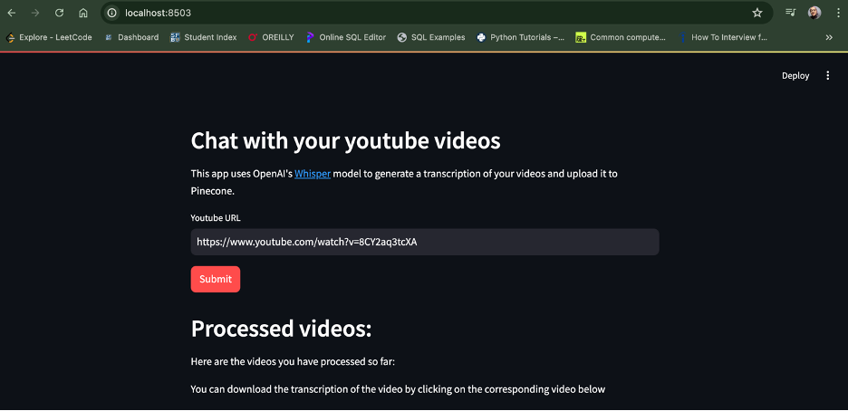
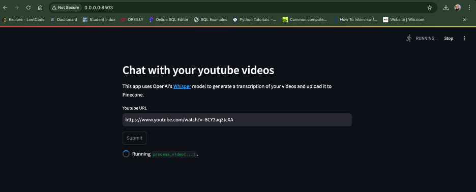
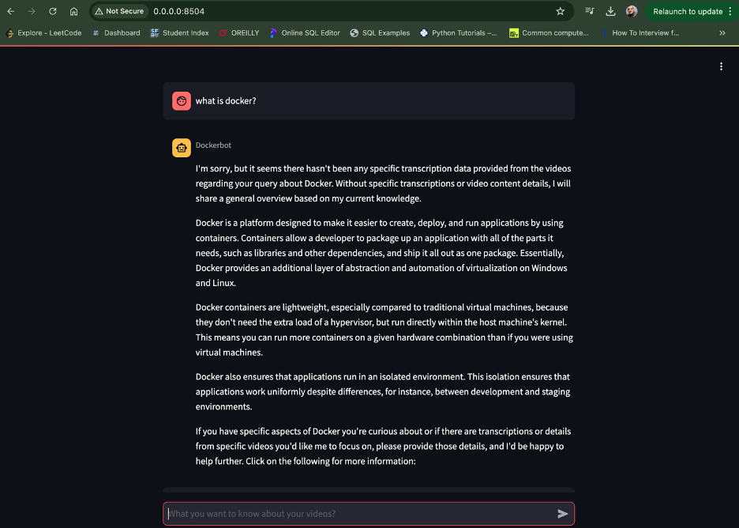
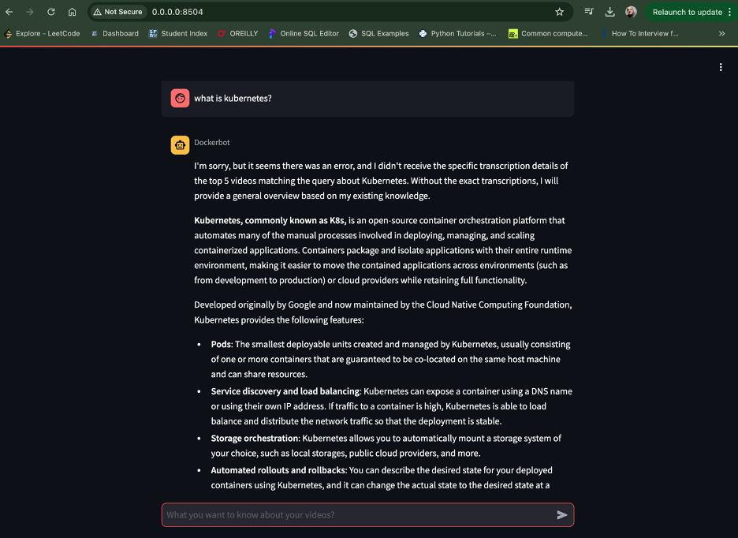

# Week 11 Homework 2: GenAI - Containerized Video Transcription and Chat App

**20097 – Zeynep Salihoglu**

## Overview
This project involves setting up a containerized environment for video transcription and a chat application using Docker. The setup utilizes services from OpenAI and Pinecone for processing and interacting with video content.

## Steps to Set Up and Run the Project

### Prerequisites
- Docker Desktop installed and running
- API keys from OpenAI and Pinecone

### Step-by-Step Instructions

#### 1. Create a Local Working Directory
- On your personal computer, create a directory where you will clone the project repository.

#### 2. Open a Terminal
- Navigate to the working directory you just created.

#### 3. Clone the Repository
- Run the following command to clone the repository from GitHub:
  ```sh
  git clone https://github.com/Davidnet/docker-genai.git
  ```

#### 4. Specify Your API Keys
- Add your billing account to OpenAI and Pinecone to obtain the necessary API keys.

- In the `docker-genai` directory, create a file named `.env` and add your API keys:
  ```sh
  vim .env
  ```

- Open the `.env` file and add the following content:
  ```env
  OPENAI_API_KEY=your_openai_api_key
  PINECONE_API_KEY=your_pinecone_api_key
  ```

#### 5. Turn On Docker Desktop
- Ensure Docker Desktop is running on your computer.

#### 6. Build and Run the Application
- In the `docker-genai` directory, build and start the services using Docker Compose:
  ```sh
  docker compose up --build
  ```

### Using the yt-whisper Service
1. Open a web browser and go to:
   ```
   http://localhost:8503
   ```

2. When the application loads, enter a YouTube video URL in the provided field. For example:
   ```
   https://www.youtube.com/watch?v=Gjnup-PuquQ
   ```



3. Click the `Submit` button to start the video transcription.

4. Wait for see running in this browser.



### Using the dockerbot Service
1. Open a web browser and go to:
   ```
   http://localhost:8504
   ```

2. Ask anything in chat and wait for the answer.





## Troubleshooting
- Verify that all necessary environment variables and API keys are correctly set up in the `.env` file.

---
